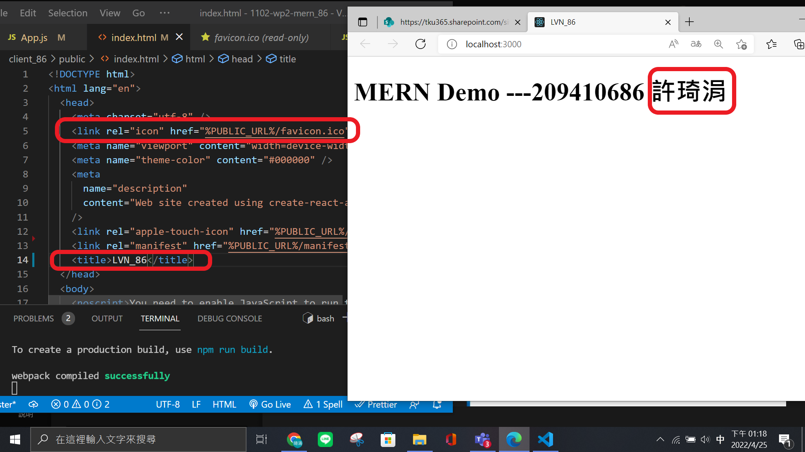
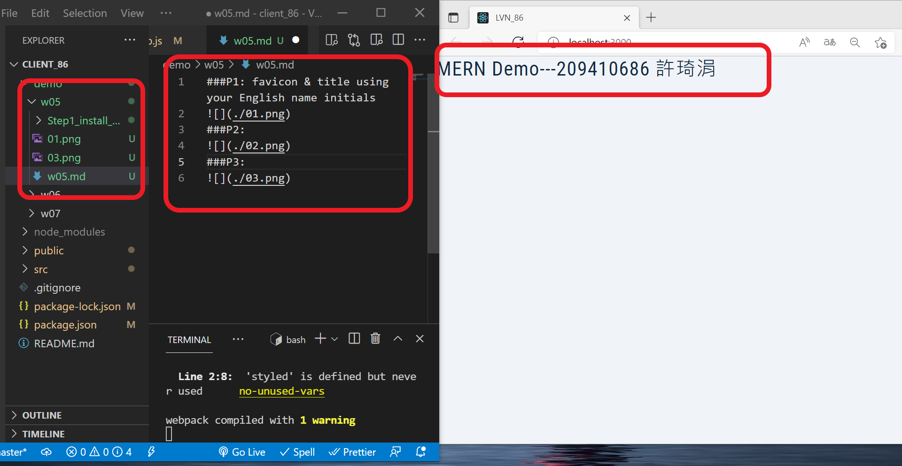
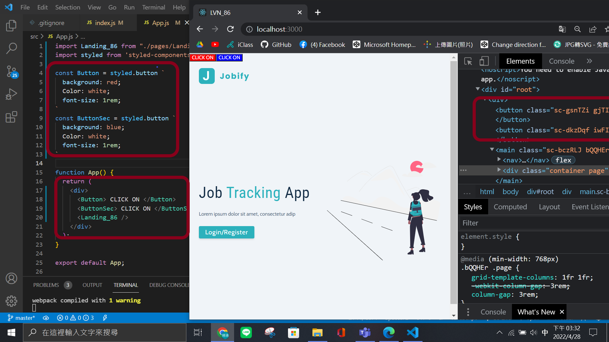
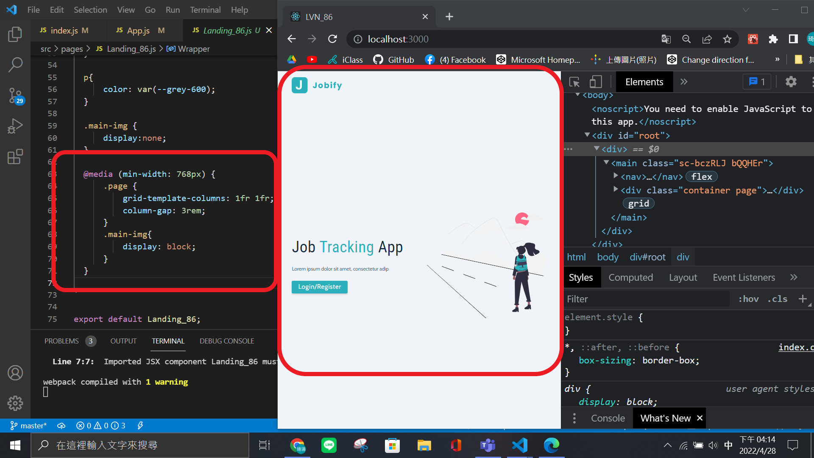
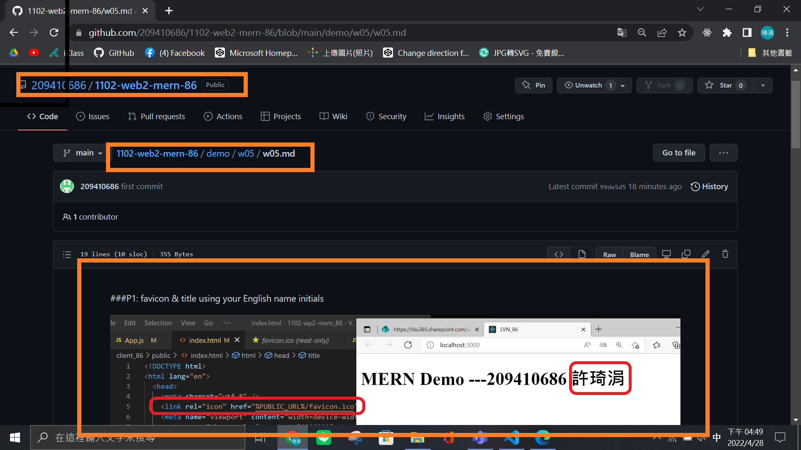

###P1: favicon & title using your English name initials

### P2: save initial setup to classdemo/w05/Step1_initial_setup

### P3: styled components demo (2 buttons)

### P4: Landing_86 styled components with Responsive Design

### P5: push w05 files to Github, and show w05_86.md

